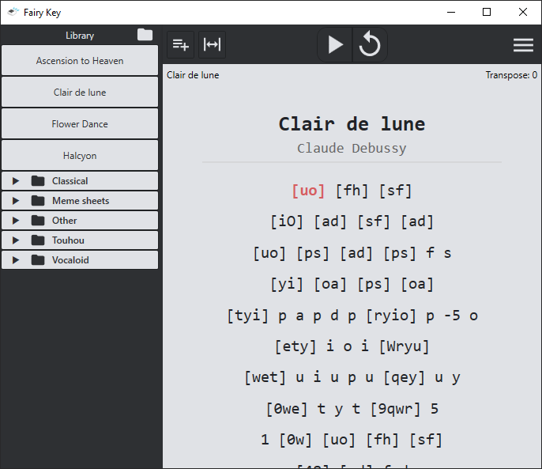

<table align="center">
<tr>
<td width="140" align="center">
    
</td>
<td align="left" style="vertical-align: middle;">
    <h1>Fairy Key: a virtual piano sheet scroller</h1>
</td>
</tr>
</table>
## 📘 Wiki & Documentation

Welcome to the Fairy Key wiki — your guide to understanding and using all of Fairy Key’s features.

## Getting started
New to Fairy Key? Check out the pages under the [Getting Started](installation.md) section!

## About
Fairy Key is a virtual piano sheet reading tool for practicing playing piano using QWERTY with features such as auto-scroll, note highlighting, a library to organize sheets, and more! 

## Resources

| Resource | Description |
|-----------|-------------|
| [Official Website](https://fairykey.app) | The official website of Fairy Key (fairykey.app) |
| [Wiki](https://wiki.fairykey.app) | This current website |
| [Fairy Key (GitHub)](https://github.com/FairyKey/FairyKey) | Main repository for the Fairy Key app |
| [Wiki (GitHub)](https://github.com/FairyKey/wiki) | Repository for this wiki |
| [Website (GitHub)](https://github.com/FairyKey/website) | Repository for the Fairy Key website |
